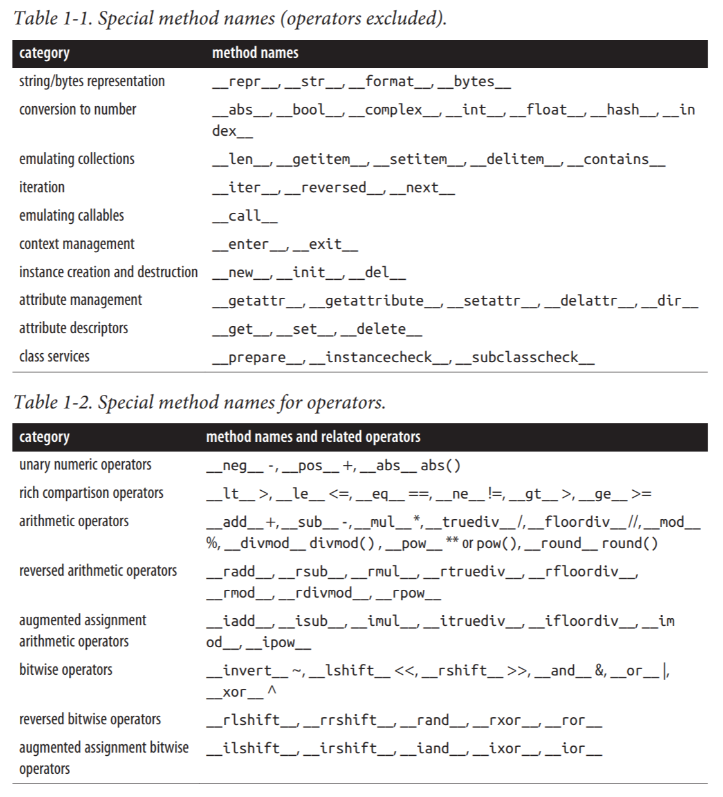
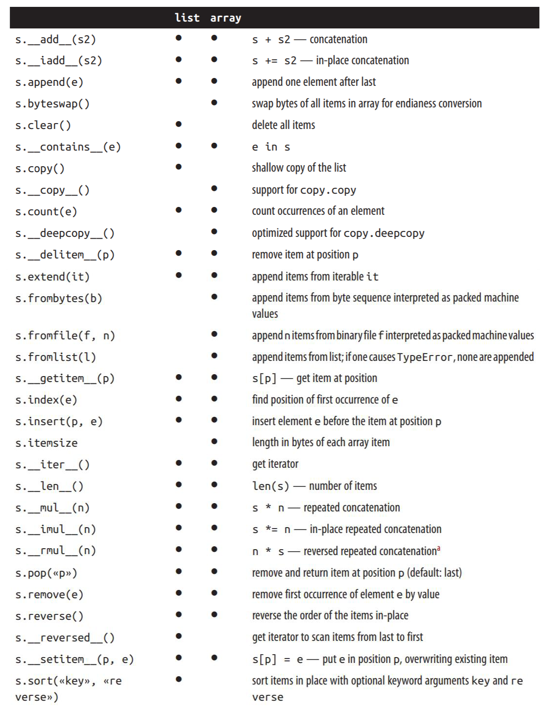
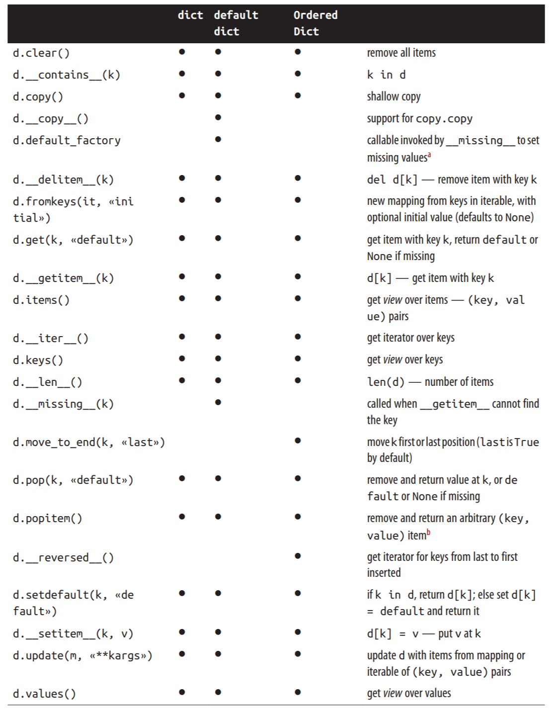
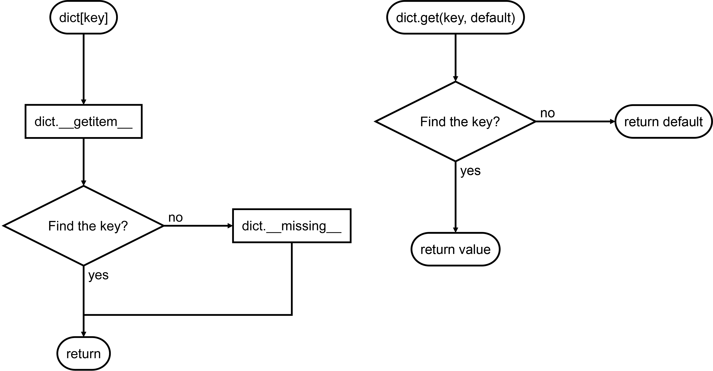
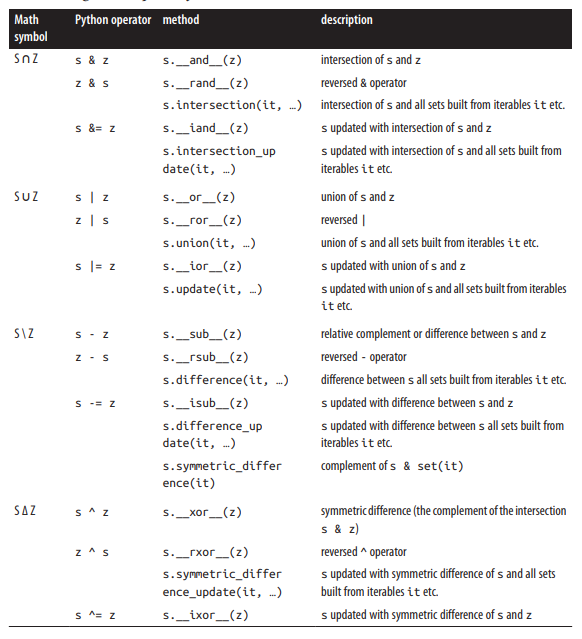
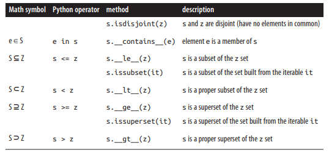

# 流畅Py - 对象和数据结构

[TOC]

好的…我也在质问自己：怎么又开了一篇Python笔记？那篇最佳Py实践填过坑么？？？经过良久思考，结论是：我乐意。~~但是标题好像越来越鬼畜了啊…~~

《Fluent Python》是一本挺有趣的书，翻开来第一个例程就让我挺服的，也不是说我写不出来，就是…写出来绝对比这丑陋…大致记一些我感觉有用的东西，也就是说，我会根据自己的情况有选择性地记录。但毕竟是笔记，主要是给自己看的，如果你有学习意向建议买书，其次也可以照着我写的目录去百度。

嗯，Fluent Python第一篇笔记就记到第三章吧。啰里啰唆写了很多、写了很久，但是感觉自己还是有所收获的，希望日后能对重点把握得更清楚些吧。

## 对象

这本书一开始就非同凡响：既然Python里什么都是对象，那不就该从对象开始讲么？嗯，很有道理。同时这一章单独一章作为本书的第一部分（序幕），可见作者确实是在强调对象的重要性。

Python的一致性除了语言设计本身之外一个重要的实现方式就是所谓“特殊方法”。实现这些特殊方法可以让你自己的对象瞬间~~爆炸~~支持很多语言架构（迭代、运算符重载等）。



有些地方管特殊方法叫魔法方法…~~古那拉黑暗之神-注释消失！~~其实也不是没道理，每次写这个的时候就感觉特优雅，特优美，~~内心十分感动~~。理解了特殊方法的意义呢，就可以明白Python超多骚操作都是怎么实现的了！

## 序列

> 在创造 Python以前， Guido曾为ABC语言贡过代码。ABC语言是一个致力于为初学者设计编程环境的长达10年的研究项目，其中很多点子在现在看来都很有 Python风格：序列的泛型操作、内置的元组和映射类型、用缩进来架构的源码、无需变量声明的强类型等等。 Python对开发者如此友好，根源就在这里。

原来如此…Python历史了解一下。这章内容是各种序列（数组）…

### 序列类型概览

| 分类                     | 类型                                             |
| ------------------------ | ------------------------------------------------ |
| 容器序列（存放不同类型） | `list, tuple, collections.deque`                 |
| 扁平序列（存放相同类型） | `str, bytes, bytearray, memoryview, array.array` |
| 可变序列                 | `list, tuple, collections.deque`                 |
| 不可变序列               | `list, tuple, collections.deque`                 |

### 列表推导和生成器表达式
```python
colors = ['silver', 'golden']
objs = ['chanzi', 'shaozi', 'meizi']
['{} {}'.format(color, obj) for color in colors for obj in objs]
#['silver chanzi', 'silver shaozi', 'silver meizi', 'golden chanzi', 'golden shaozi', 'golden meizi']
('{} {}'.format(color, obj) for color in colors for obj in objs)
#<generator object <genexpr> at 0x00000174EEAC32B0>
```
把[]换成()就可以把列表推导变成生成器表达式！

### 元组

元组不可变，因此元组中每个数据的位置是有意义的。

```python
lost = ('golden', 'chanzi')

#元组拆包的应用之一，平行赋值
color, obj = lost #color='golden', obj='chanzi'

#用*把可迭代序列拆开作为函数的参数
'I lost a {} {}!'.format(*lost) #'I lost a golden chanzi!'

#用*处理剩下的元素
color, *rest = lost #color='golden', rest=['chanzi']
```


### 具名元组
```python
from collections import namedtuple
Lost = namedtuple('Lost', 'color obj')
mylost = Lost('golden', 'chanzi') #Lost(color='golden', obj='chanzi')
```
因为字段名存储在具名元组类里，内存使用量和元组相当。声明具名元组类时，第二个参数可以是空格隔开的字段名也可以是包含字符串的序列。

### 切片
```python
s = list(range(5)) #[0, 1, 2, 3, 4]
#切片 seq[start:stop:step]
s[0:3:2] #[0, 2]
#用可迭代对象给切片赋值
s[::2] = [100, 200, 300] #[100, 1, 200, 3, 300]
```
记住！切片和区间操作不包括范围里的最后一个元素，即[start, stop)。~~每次都要纠结半天然后决定随缘，看索引有没有超出上限来调试的日子结束了！~~这样设计的意义首先是方便计算切片的长度，其次这样可以用同一个下标把切序列成两半而不会有重叠。
> http://www.cs.utexas.edu/users/EWD/transcriptions/EWD08xx/EWD831.html
> Why numbering should start at zero
> 所有区间都采用[start, stop)的形式的好处有：能用自然数做上下界取到任何自然数；便于切割序列；便于取单个元素；便于计算长度；因此，从0开始计数时[0, N)表示长度为N的序列。

多维切片和省略看[Tentative NumPy Tutorial](https://scipy.github.io/old-wiki/pages/Tentative_NumPy_Tutorial)吧，反正标准库里没这种操作的。
然后就是用可迭代对象给切片赋值…又是骚操作，但是笔者根本想不到什么时候能用上？

### +和*
用`+`可以拼接序列，用`*`可以重复序列，`+=`就地拼接，`*=`就地重复。一个坑是比如企图用`[[1]] * 3`偷懒代替`[[1], [1], [1]]`时，其实返回的会是三个相同的引用（都指向`[1]`）组成的数组，也就是说，企图修改数组中的一个值只会导致整个数组里的都被修改。

> 那么，你学会复读了吗？给你表演一下哦：
> \>\>\> '人类的本质就是复读机' * 3
> '人类的本质就是复读机人类的本质就是复读机人类的本质就是复读机'

### 排序
没啥特别的。list.sort是就地排序，sorted(list)会复制一份再排序。这里又开始讲Python哲学了…为了让你知道这个方法没有新建对象，像list.sort这种就地操作都是没有返回的…你可以用bisect.bisect和bisect.insort执行二分查找和二分插入哦吼吼~~完全不关心~~。

### 当世界失去了列表
- array.array只包含数字的高效序列。有很方便的tobytes()和tofile()方法，用来处理大量数学信息应该很酷。
- memoryview即内存视图，允许你用不同方式读写同一块内存，感觉和C++里的Union非常相似？
- deque是双向队列，猜猜为什么不直接用列表？对啦！又双叒叕是因为性能！~~要不是学过点算法对算法心有余悸deque笔者肯定管都不管…~~





## 字典和集合
dict太重要了，不仅在各类程序中广泛应用，也是 Python 语言的基石。以下是dict的构造方法，一般来说构造这部分内容笔者好像都会略过，但是实际上了解一下构造方法既有助于将来游刃有余地处理类型转换也有助于了解数据类型设计的思想。~~那些感觉高级语言怎么瞎写都行的人，了解一下所谓的混乱背后是怎么实现的吧：）~~

```python
>>> a = dict(one=1, two=2, three=3)
>>> b = {'one': 1, 'two': 2, 'three': 3}
>>> c = dict(zip(['one', 'two', 'three'], [1, 2, 3]))
>>> d = dict([('two', 2), ('one', 1), ('three', 3)])
>>> e = dict({'three': 3, 'one': 1, 'two': 2})
>>> a == b == c == d == e
True
```


### 字典推导
还有什么好说的呢…把列表推导的`[]`换成`{}`，键值对表达为key:value就是了。
```python
{x:y for x,y in [(1,2), (3,4)]} #你猜会返回什么
```

### 解决404 key not found

> 对不起，我错了！
> 我再也不写dict.get(key, default)了！

取字典中不存在的键时Python会直接报错，或许你觉着get(key, default)就能避免，但是，你考虑过**更新**操作的感受吗？每次更新前都先取一次值判断一下存不存在再赋值是不是很别扭？其次，get()不优美，万一初始值变了每个用get()的地方都得改，讲道理初始值只应该在一个地方说明清楚。

所以，对于更新这种**链式操作**，可以通过dict.setdefault(key, default)一步完成赋默认值：
```python
my_dict.setdefault(key, []).append(new_value)
#等同于：
if key not in my_dict:
    my_dict[key] = []
my_dict[key].append(new_value)
```
那如果只是想给序列中的任意键设置一个默认值呢？下面来讲讲字典的特殊方法\_\_missing\_\_。首先要知道dict[key]和dict.get(key)是不一样的。笔者做了两张流程图来展示：



所以，其实\_\_missing\_\_只会被\_\_getitem\_\_调用，而跟dict.get()没关系。下面是一个典型用例：

```python
class StrKeyDict0(dict):
    def __missing__(self, key):
        if isinstance(key, str):
            raise KeyError(key)
        return self[str(key)]

    def get(self, key, default=None):
        try:
            return self[key]
        except KeyError:
            return default

    def __contains__(self, key):
        return key in self.keys() or str(key) in self.keys()
```
- 这个类的作用是，首先\_\_getitem\_\_尝试在字典中找到键对应的值，如果不存在的话交给\_\_missing\_\_把键转换成字符串再进行查找，这样还找不到就返回KeyError
- 重载dict.get()来使它能调用\_\_missing\_\_
- 为了保持一致性（能获取到值的键当然应该在`k in d`时返回True），\_\_contains\_\_也被重写了。使用self.keys()是为了避免递归调用自己而死循环。

理解\_\_missing\_\_之后就很好理解Python的另一个数据类型defaultdict。构造defaultdict时需要传入一个可执行对象，其返回值就是这个字典的默认值。因为这个类型正式通过\_\_missing\_\_实现的，因此只有调用\_\_getitem\_\_才会有默认值。用例如下：
```python
my_dict = defaultdict(list)
```

### 超级变换形态
又到了“好厉害好强大但是我这辈子可能都不会用”时间了。
- collections.OrderedDict
键总是保持有序排列的字典。
- collections.ChainMap
- collections.Counter
每个键会有一个计数器，每次更新值就会+1…
- collections.UserDict
  - 用纯Python实现的标准dict。往往用于继承写子类。
  - 因为UserDict继承了Mapping.get，而Mapping.get的实现与前文中StrKeyDict0.get的实现是一模一样的，因此一般不需要再重载get。
  - 其实UserDict的属性里有一个叫data的dict实例，相当于只是在dict外面套了个壳子，因此\_\_contains\_\_不用担心会递归，写起来也更轻松。

### 映射视图
啊…用户真笨啊是吧，所以…你要保护你的列表不被意外修改。通过`types.MappingProxyType(dict)`来返回一个只读的映射视图吧。

### 集合论

现在闭上眼，开始回忆高中数学——集合具有互异性（集合元素互不相同）和无序性。好的，Python的set和frozenset（不可变）也是一模一样。然后…贴两张表：





### 幕后黑手
为何容量增大字典索引却依然如此之快？字典又为什么是无序的？~~敬请关注今晚八点KLOG10年度巨献《走进算法》。让我们跟随着镜头走进怪异码农世界的真相…~~

字典实际上是用散列表来实现的。散列表简单讲就是给每个键取个**散列值**（可以理解为ID），然后根据散列值中的某几位来排好位置，每次进行查询时根据预先排好的位置来一步到位找到键。但现实没有这么美好，数据多了以后只取散列值中的某几位可能会有好几个键排在一起无法分辨，因此需要对散列表进行扩容（多取几位散列值）再进行搜索。其实以后看算法一定会再见的，这里先做一些了解好了。

因此，只有**可散列的**数据类型可以作为映射的键。可散列的定义大致有这三点：
- 必须实现\_\_hash\_\_()来返回散列值，且在生命周期内不会变化
- 必须实现\_\_eq\_\_()来比较散列值是否一致
- **原子不可变**数据类型(str,bytes,数值类型 )都是可散列类型。

散列表是典型的内存换速度，所以字典的特点有内存花销大、速度快$O(n)=n$，键的次序不定。