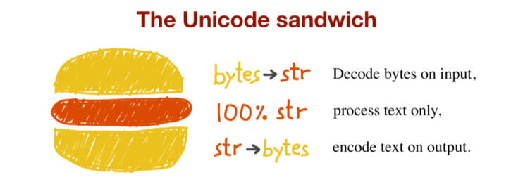

# 流畅Py - 文本和字符序列

> 穿越时空，竭尽全力，我又打开了这本书。

## 字符序列

Python 3中的`str`对象是由Unicode字符组成的序列。然后感到有点头大：Unicode字符到底是什么…

ASCII只规定了128个字符，相当于半个字节，剩下半个字节怎么安排各路神仙都各显神通，更有比如说劳动人民的老朋友`GB2312`用了两字节表示一个汉字；而有混乱的地方就有标准，于是Unicode就诞生了。Unicode给世界上的每个符号都安排上了一个数字“标识”，想知道这个世界上究竟有多少符号吗？[Unicode Character Code Charts](https://www.unicode.org/charts/)是目前的标答。

Unicode给每个符号安排了标识，即*码位*，由4~6个Hex数字表示，并且加上前缀`U+`，如`摸`的Unicode码位是`U+6478`。而字符的具体表述（存储的形式）取决于所使用的*编码*。而人民喜闻乐见的`UTF-8`则是编码的一种，如`摸`可以用UTF-8编码成三个字节`\xe6\x91\xb8`。码位转换成字节序列的过程是*encode*，反之就是*decode*。

**课外阅读** 关于各种规范的历史和编码的具体实现这部分内容可以看阮一峰的这篇笔记，总结得挺完整的：[字符编码笔记：ASCII，Unicode 和 UTF-8](https://www.ruanyifeng.com/blog/2007/10/ascii_unicode_and_utf-8.html)~~阮一峰nb！~~

## 字节序列

`bytes`和`bytearray`是两种字节序列，即它们的组成元素是一个个0~255之间的整数。前者是不可变的，后者可变。最常用的构建方式是：

```python
>>> touch = bytes('摸', encoding='utf8')
>>> touch
b'\xe6\x91\xb8'
```

当然你也可以直接通过编码`str`得到：

```python
>>> touch = '摸'.encode('utf8')
>>> touch
b'\xe6\x91\xb8'
```

关于二进制处理，`memoryview`对象允许在二进制数据结构之间共享内存；`struct`模块可以用来从二进制序列中提取结构化信息。

## 说说Python源码的编码问题

在Python的源码里使用中文的话很可能你会遇到很神秘的SyntaxError，网上又会建议你在源码的第一行写上`# coding:<encoding>`搞得一头雾水，看完以上的内容我们可以分析一下这个问题。

首先，这里之所以会导致`SyntaxError`是因为Python解释器没法正确读取源码中的Unicode字符。而`# coding:<encoding>`则是声明源码的编码格式，告诉编译器用什么编码来读取这个源码文件。所以如果没有声明编码格式的话，Python解释器会把源码当作ASCII（Python 2）或者 UTF-8 （Python 3）来读取，如果不凑巧编码不正确的话就会读取失败，造成`SyntaxError`。

那为什么不加中文的时候就能正确读取而不会报错呢？这是因为ASCII中的符号在UTF-8和GB2312（我相信还有其它绝大多数编码）中字节都是一样的。所以不管用什么编码去读解释器都不会出错。

再多说几句好了…Windows自带的笔记本默认格式是ANSI，这是一种入乡随俗编码，在中国它是`GB2312`，在日本它是`Shift_JIS`，在韩国它又是`EUC-KR`，这是由系统区域（locale）定义的，微软也管这个叫`codepage`。Notepad在保存的时候可以选择编码格式。

[PEP 263](https://www.python.org/dev/peps/pep-0263/)中定义了必须在第一或第二行用`# coding:<encoding>`来声明编码格式。所以，请，为了大家都能阅读代码，用UTF-8吧；保护Python解释器，请声明编码格式。没有偷懒，就没有杀害。~~这是来自utf8狂热信徒的号召~~

**课外阅读** [Python 文件的编码声明](https://blog.windrunner.me/python/encoding.html)

## 处理文本



处理文本的最佳实践是“Unicode三明治”，即`解码输入的字节（上层面包）`->`处理文本（肉片）`->`编码输出的字节（下层面包）`。~~话说这个不是汉堡包么…~~

正如先前所说的，各种系统甚至不同版本的解释器有着不同的编码默认值，所以请拒绝编码默认值，读取文件时请务必显式指定编码。

为了正确地比较和排序，你可能需要规范化Unicode字符串或是调用特殊的排序软件。这个嘛，就不展开了。
