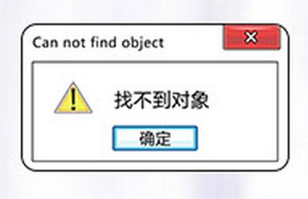

# 计算机视觉从入门到脱发

2019-09 @武折口

[TOC]

## Week1. Python语言培训

本周我们将继续Python的学习！上周我们已经学习了Python最最基础的一部分语法及数据结构，本周将会进一步学习一些Python相对于C语言非常特殊的地方，并为下礼拜的内容做一些铺垫。

因为本周例会内容讲得稍许有点太深入了但不全面，所以这里说明一下，Python的学习鼓励大家自由地去看自己找的教程（这里给出我之前看过但算不上非常非常推荐的[廖雪峰的Python3教程](https://www.liaoxuefeng.com/wiki/1016959663602400/1017269809315232)），挑自己感兴趣的看或者按顺序看都行。而视觉组培训时我会尽量从一个和大部分Python教程都不一样的思路讲，即，我会从对象进行切入，希望大家对“为什么Python这门编程语言如此特殊”有整体性的认识，而不是通过一点一点零碎的语言特性去“盲人摸象”。我清楚这样的教学思路会让入门门槛变得很高，但是这样却十分有利于各位将来深入学习Python而不是仅仅“我会一点Python”。

### 函数参数

函数参数在C语言中可玩性较差，必须声明对应的每一个形参分别是什么类型的什么变量；而C++中有函数重载，也就是有那么好几个名字相同的函数，但是它们的形参有所不同，在调用时C++会自动判断你想调用的是对应哪个版本的函数。而Python中的函数参数有位置参数、默认参数、可变参数、关键字参数和命名关键字参数，因此Python中调用函数时有各种花式写法，极大地避免因为输入的参数有所不同所以要写五六个功能类似的函数的问题。因此笔者认为Python的函数参数可玩性是远高于于C/C++的。

位置参数、默认参数、可变参数、关键字参数和命名关键字参数的区别和实例见：[这里](https://www.liaoxuefeng.com/wiki/1016959663602400/1017261630425888)。

### 初识OOP：面向对象编程

不知道大家有没有看过一个很老土的程序员笑话，一个上面写着“找不到对象”…就是下面这个…此处大家一起默哀十秒。



其实呢，这里的对象指的并不是`npy`，而是`object`，是不是很神奇呀？

> NO.

那Object到底是个啥呢？我有一言，请诸位静听：过去大家在写代码时往往都是把一个程序的流程分为几块，然后按`Step1`, `Step2`, `Step3`这样的顺序去写代码，然后运行。久而久之大家会发现，如果我今天有一个类似的程序要实现类似的功能呢？那就需要在原来的代码中进行大幅度修改了。

比如今天有一个能控制步兵机器人移动和射击的程序，大家可能会写一个死循环，让程序始终运行，然后循环里先进行移动，再进行射击。下面给出的伪代码（伪代码就是并不能实际运行但大家能读懂意思的代码）为了版面简洁移动我们就写了个函数表示对应功能，但大家可想而知让机器人运动起来不可能那么简单。可以跑和射击的步兵机器人：

```c
while(True){
    // for infantry
    run(5);    // moving speed is 5
    shoot(1);  // shoot 1 bullet
    delay(1);  // wait some time before next iteration
}
```

好，那么问题来了，如果今天我们的代码要用在工程机器人上呢？那么原来程序中每一行有关步兵机器人的内容都得被替换成工程机器人。另外，如果工程机器人另外还有一个取弹功能呢？那就得在循环体内再加一段实现取弹功能的代码了。跑得更慢，不能射击，可以取弹的工程机器人：

```c
while(True){
    // for engineer
    run(3);    // moving speed is 3
    // no shoot() because engineer can't shoot
    fetch(3);  // fetch 3 boxes
    delay(1);  // wait some time before next iteration
}
```

久而久之我们发现问题远没有那么简单，假设我们有5种机器人，它们功能类似却又各有不同，它们的参数也有所差异，采用原来的编程方式我们得把同一段代码复制5遍，然后一行行改成相应的机器人的参数，然后再给每个机器人实现它不同的功能。最后我们会发现代码内部重复度非常高，而且万一哪个部分的代码要修改是相当麻烦的。

因此，我们可以尽量想想办法。比如说，我先用一些变量来说明各个机器人的参数，再根据它是那种机器人调用不同的功能：

```c
type = "infantry";
speed = 5;
shootNumber = 1;
fetchNumber = 0;
while(True){
    run(speed);             // moving speed is $speed
    if(type=="infantry"){
        shoot(shootNumber); // shoot $shootNumber bullets
    }
    if(type=="engineer"){
        fetch(fetchNumber); // fetch $fetchNumber boxes
    }
    delay(1000);            // wait some time before next iteration
}
```

这样的话，只要把type和其它几个变量修改一下就可以实现不同的机器人，下面的循环部分根本不需要修改。因此，我们很自然地会想到，是不是我们在试图为某个事物写代码的时候，可以先区分出它的“属性”和“功能”，然后再统一为这类的事物写出同一套代码呢？

> YES.

那，这就引出了面向对象编程！也就是说，我们先不考虑程序要按什么顺序去执行哪几个步骤以及具体的参数，直接去抽象出要编程的这个事物有哪些属性和功能（在面向对象里叫方法`method`），最后才说明这个事物有哪些功能和具体的参数。那前者“抽象”的其实就是“类”，后者具体去说明的就是“对象”了。下面给出Python中实现上述机器人功能的类：

```python
class Robot():

    def __init__(self, robot_type, speed, shootNumber, fetchNumber):
        self.robot_type = robot_type
        self.speed = speed
        self.shootNumber = shootNumber
        self.fetchNumber = fetchNumber

     def update(self):
        self.run(self.speed);
        if self.robot_type == 'infantry':
        	self.shoot(self.shootNumber);
        if self.robot_type == 'engineer':
        	self.fetch(self.fetchNumber);

     def run(self, speed):
        print('run at {%d}.'%speed)

     def shoot(self, shootNumber):
        print('shoot {%d} bullets.'%shootNumber)

     def fetch(self, fetchNumber):
        print('fetch {%d} boxes.'%fetchNumber)
```

我理解，我理解，现在你可能比较懵逼。我来解释一下，首先上述代码第一行说明了我现在在写一个类，名字叫Robot。然后接着里面包括了5个函数，也就是“方法”：第一个`__init__`是初始化一个机器人的时候要做什么，在例子中就是给自己设置四个属性；第二个`update`是更新机器人的状态；后面三个就是具体的功能了，这里用输出一行信息来代替实际的功能。然后有一点需要注意，每个方法的第一个形参总是`self`，就表示机器人自己，同理`self.xxx`表示调用自己的某个属性。

初见可能会觉得好像用类使代码变得非常复杂，但实际使用时你就会发现它十分好用，这是步兵机器人代码：

```python
robot = Robot('infantry', 5, 3, 0)
while True:
    robot.update()
```

这是工程机器人代码：

```python
robot = Robot('engineer', 3, 0, 3)
while True:
    robot.update()
```

我们发现：对于不同的机器人只需要修改一行的参数就够了！那之后无论我们有多少种机器人，分发起来都不是什么难事，而且对于拓展功能而言我只需要修改一下update函数的内容就行了。当然，这里只是为大家介绍了面向对象最最最基本的编程思想，Python中的类还有继承、操作符重载、元编程等超有意思的功能，本周暂且不介绍了。

那，究竟为什么这里这么早就要介绍OOP呢？你会发现大部分教程里OOP都是挺后面才出现的内容，而之所以这里先介绍OOP，是因为Python中的一切都是对象！也就是说，Python中无论是字典、列表、元组，还是字符串、函数统统都是对象（没错函数也是对象）。这就意味着，上面的例子讨论的只是不同的机器人有不同的功能，Python对内部的一切元素都进行了抽象，同为对象但实现了不同方法构成了上述各种元素之间的不同，甚至造成了语法的不同。理解了这一层，将为你后续学习Python各种不同的元素提供一个整体性的认识。

### 本周作业

试着写一个可以定义`height,sex,name,weight`等属性，拥有`eat(),sleep(),touchfish()`等方法的类，名字叫`NormalHuman`。并且，实例化几个对象出来。
